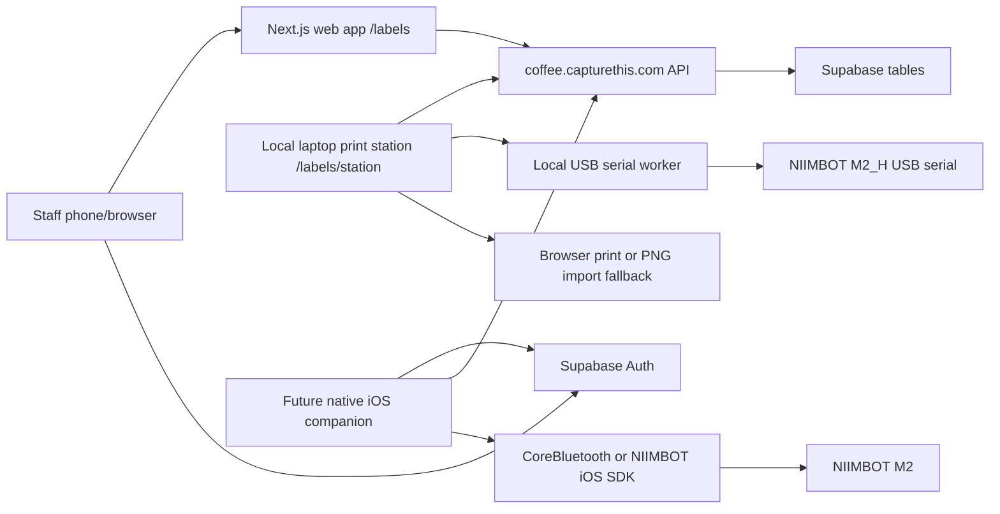

# Label printing architecture

## Recommendation

Use the web app's label queue plus a local laptop print station. Keep the native
iOS companion as a later path if direct mobile printing is still needed.

This is the operating model for Capture This Coffee:

- `coffee.capturethis.com` is the shared system of record for jobs, people,
  orders, label payloads, queue state, and print history.
- Physical printing belongs to a local station running on the same laptop as the
  printer. The cloud site must never be expected to open USB, serial, Bluetooth,
  or OS printer devices attached to somebody's machine.
- A printer station is repeatable and disposable: install the app, connect a
  supported NIIMBOT, run the local station, claim queued jobs, print, and report
  success/failure back to the master queue.
- The station can use local USB serial as the primary path on confirmed M2_H
  hardware, with browser print and PNG import as operator fallbacks.
- Printer serial numbers are diagnostic identity data, not master-site config.
  The local station selects its local device path or future local device ID.

The laptop print station is the lowest-risk operational path because `/labels`
can create queued print jobs and `/labels/station` can claim them, render 50mm x
30mm labels, and execute printing from the machine physically connected to the
printer. It should remain the production fallback even if iPhone printing works
later.

The iOS companion should be native Swift first, not a pure web wrapper. iOS
Safari and iOS Chrome cannot use Web Bluetooth for the M2, and iOS does not
expose generic USB printer access to web apps. A Capacitor wrapper only becomes
useful if it includes a custom native Bluetooth/NIIMBOT plugin; at that point the
hard part is still native iOS printing. React Native is viable, but it adds a
bridge layer around the most uncertain piece: NIIMBOT SDK or CoreBluetooth
printer control. Start in Swift so SDK samples, CoreBluetooth diagnostics, and
Apple Bluetooth permissions are direct.

The web app should own business data, label content, print job state, audit
history, and fallback printing. The iOS app should own local printer discovery,
connection state, rasterization if required by the SDK, and print execution.

## System shape



## Print job model

A print job should be an auditable database object, not just a UI action.

Use a versioned payload so the app can print old jobs even after label UI changes:

```json
{
  "version": 1,
  "label_size": { "width_mm": 50, "height_mm": 30 },
  "printer_family": "niimbot_m2",
  "dpi": 300,
  "source": {
    "production_id": "uuid",
    "order_id": "uuid",
    "person_id": "uuid"
  },
  "label": {
    "id": "order uuid or manual id",
    "personName": "Ava",
    "drink": "Iced oat latte",
    "group": "Set",
    "productionClient": "Shoot / Client",
    "notesStatus": "Confirmed",
    "title": "Ava",
    "bodyLines": ["Iced oat latte"],
    "footerStart": "Set",
    "footerEnd": "Shoot / Client",
    "lines": ["Ava", "Iced oat latte", "Set - Shoot / Client"]
  },
  "options": {
    "style": "standard",
    "fields": {
      "personName": true,
      "drink": true,
      "group": true,
      "productionClient": true,
      "notesStatus": false
    }
  }
}
```

The existing `CoffeeLabel` shape in `src/lib/label-copy.ts` should remain the
canonical label content model. Browser print, laptop station print, iOS SDK
print, and any future bridge should all consume that model or a versioned
snapshot of it.

## Supabase schema additions

Add these tables before the iOS MVP:

- `label_print_jobs`
  - `id uuid primary key`
  - `production_id uuid references productions(id)`
  - `order_id uuid references orders(id)`
  - `person_id uuid references people(id)`
  - `created_by uuid references auth.users(id)`
  - `assigned_to uuid references auth.users(id)`
  - `status text check in ('queued','claimed','printing','printed','failed','cancelled')`
  - `priority integer default 0`
  - `payload jsonb not null`
  - `rendered_png_path text`
  - `printer_family text default 'niimbot_m2'`
  - `copies integer default 1`
  - `claimed_at timestamptz`
  - `printed_at timestamptz`
  - `error_message text`
  - `created_at timestamptz default now()`
  - `updated_at timestamptz default now()`

- `label_print_attempts`
  - `id uuid primary key`
  - `job_id uuid references label_print_jobs(id)`
  - `staff_user_id uuid references auth.users(id)`
  - `device_id uuid references printer_devices(id)`
  - `status text check in ('started','succeeded','failed','cancelled')`
  - `transport text check in ('ios_ble','laptop_browser','laptop_usb','bridge')`
  - `printer_name text`
  - `printer_identifier text`
  - `sdk_version text`
  - `error_code text`
  - `error_message text`
  - `started_at timestamptz default now()`
  - `finished_at timestamptz`

- `printer_devices`
  - `id uuid primary key`
  - `staff_user_id uuid references auth.users(id)`
  - `name text`
  - `model text`
  - `transport text`
  - `native_identifier text`
  - `last_seen_at timestamptz`
  - `metadata jsonb default '{}'::jsonb`

RLS currently follows the shared private-demo policy: any signed-in Supabase Auth
user can read and write app and print-job data; anonymous users cannot. Longer
term, add roles for admin versus field staff, but do not block the demo handoff
on `app_metadata.staff`.

## Next.js repo changes

Use App Router route handlers under `src/app/api/.../route.ts`. Per the local
Next.js 16 docs, route handlers live inside `app`, use standard Request/Response
APIs, and are not cached by default for mutating methods.

Concrete changes:

- Print-job pieces now exist in the app:
  - `src/lib/print-jobs.ts`
  - `src/lib/supabase-server.ts`
  - `src/lib/label-queue.ts`
  - `POST /api/print-jobs`
    - creates one or more jobs from order IDs or a manual label payload.
  - `GET /api/print-jobs?status=queued&production_id=...`
    - used by station queue views and local worker spikes.
  - `POST /api/print-jobs/[id]/claim`
    - marks a queued job claimed by the current authenticated user.
  - `POST /api/print-jobs/batch/claim`
    - claims a batch for station printing.
  - `POST /api/print-jobs/[id]/attempts`
    - records started/succeeded/failed attempts.
  - `POST /api/print-jobs/[id]/complete`
    - marks job printed and sets `orders.label_printed = true` in one
      RPC.
  - `POST /api/print-jobs/batch/complete`
    - completes a station batch after physical confirmation.
  - `POST /api/print-jobs/[id]/fail`
    - releases or fails a job with a printer-facing error.

Current routes:

- `/labels`
  - keeps browser print as the fallback;
  - creates remote `label_print_jobs` for the station;
  - still treats `orders.label_printed` as the final visible success flag.
- `/labels/station`
  - claims queued jobs;
  - prints through the browser path or downloads a 300 DPI PNG for NIIMBOT app
    import;
  - records attempts and completes/fails jobs after operator confirmation.

- Add migration:
  - `supabase/migrations/YYYYMMDDHHMMSS_add_label_print_jobs.sql`
  - includes tables, indexes, RLS policies, and an RPC for atomic completion:
    `complete_label_print_job(job_id uuid, attempt_id uuid)`.

- Update generated/local database types:
  - extend `src/lib/supabase.ts` for the new tables/functions until generated
    types are introduced.

## iOS app plan

Build a small Swift app with four screens:

1. Sign in
   - Supabase email/password or magic link.
   - Store the session in Keychain.
   - Match the web app's current auth policy: signed-in Supabase users only.

2. Production queue
   - List active productions and open label jobs.
   - Allow "sync latest", "claim next", and "manual label".

3. Printer
   - Discover nearby NIIMBOT M2/M2_H devices.
   - Pair/connect, show battery/status if available, and persist the last
     working peripheral identifier.

4. Print confirmation
   - Render preview from the job payload.
   - Print, then mark success/failure through the API.

Communication:

- Use Supabase Auth for identity.
- Send `Authorization: Bearer <access_token>` to Next.js API route handlers.
- Use Supabase Realtime later for queue updates; polling every few seconds is
  enough for the MVP.
- Do not put service-role keys in the iOS app.

Printer connection:

- If NIIMBOT provides an iOS SDK with M2 support, use it.
- If no SDK is available, use CoreBluetooth only for a spike:
  - scan for advertised M2 devices and/or known service UUID
    `e7810a71-73ae-499d-8c15-faa9aef0c3f2`;
  - connect to characteristic `bef8d6c9-9c21-4c9e-b632-bd58c1009f9f`;
  - send only known harmless status/version commands first;
  - print only after command framing, checksums, raster format, density,
    feed/cut behavior, and completion status are understood.

CoreBluetooth can probably connect to the M2, but connection is not the same as
printing. The print protocol is the risk. The official SDK is the preferred path
because it should handle command framing, image conversion, status, retries, and
model differences.

## Phased implementation

### Phase 0: Operational fallback

- Keep current `/labels` browser print.
- Calibrate 50mm x 30mm CSS with the real M2 over laptop USB/driver.
- Document the working printer settings.

### Phase 1: Print job queue in the web app

- `label_print_jobs`, `label_print_attempts`, `printer_devices`, and route
  handlers for create/claim/attempt/complete/fail now exist.
- `/labels` can queue labels and `/labels/station` can claim and print or
  download them.
- This lets phones create/manage jobs in the web app even before phones can
  physically print.

### Phase 1b: M2_H USB serial spike

- USB serial probing and status checks are confirmed on macOS via
  `/dev/cu.usbmodem*`.
- Diagnostic bitmap and glyph tests have physically printed from the M2_H using
  a B1-style task sequence and progress polling.
- `scripts/label-serial-worker.mjs` is the local station worker for app-label
  USB printing. The `/api/print-jobs/[id]/usb-print` route is intentionally
  local-only: it must run from localhost on the printer laptop and is guarded
  against hosted/serverless execution.
- Before handing the station to another operator, validate the full sequence on
  that laptop: probe, status check, one queued label, physical confirmation,
  retry/release, and fallback browser/PNG print.

### Phase 2: iOS proof of print

- Request NIIMBOT iOS SDK access and M2 sample code.
- Build a minimal Swift app that signs in, fetches one job, connects to the M2,
  and prints a fixed calibration image.
- Then print a server-provided PNG or SDK-native text/image label generated from
  the job payload.

### Phase 3: Field-ready iOS MVP

- Add queue claiming, retry/fail handling, saved printer, and print confirmation.
- Add offline-tolerant UI for already-fetched jobs, but require network to mark
  final success.
- Add device/attempt telemetry so failed sets can be diagnosed.

### Phase 4: Optional local bridge

- If iOS direct printing fails but laptop station works, consider a small local
  bridge on a Mac/PC that polls `label_print_jobs` and prints to USB/Bluetooth.
- This is useful for a production office or truck, not as the first field-phone
  solution.

## Lowest-risk MVP

The MVP should be:

1. Treat the cloud website as the master queue and audit trail.
2. Treat each printer laptop as a local station that owns physical printing.
3. Use local USB serial where confirmed; keep laptop browser printing and PNG
   import as guaranteed fallbacks.
4. Let phones create/claim/manage jobs through the existing web app or a tiny
   iOS shell.
5. In parallel, continue the Swift proof-of-print spike only if mobile-native
   printing becomes necessary.

This delivers useful field workflow immediately while isolating the uncertain
Bluetooth/protocol problem.

## Avoid for now

- Do not build a pure Capacitor wrapper and expect Bluetooth printing to work.
- Do not assume AirPrint works with the M2.
- Do not build a full custom BLE print protocol before exhausting NIIMBOT SDK
  access.
- Do not expose the hosted site's USB print button as if it can reach a local
  printer. USB printing is only valid from localhost on the printer laptop.
- Do not make the iOS app the system of record for print state.
- Do not mark orders printed before a real print success or explicit staff
  confirmation.
- Do not store Supabase service-role credentials in native apps or local bridges.
- Do not remove laptop/browser printing after iOS printing works; keep it as the
  operational fallback.

## Real NIIMBOT M2 test checklist

Baseline:

- Print a label from the official NIIMBOT iPhone app.
- Record exact printer model, firmware, label stock, ribbon, and app version.
- Confirm 50mm x 30mm media orientation and physical printable area.

Laptop fallback:

- Install NIIMBOT desktop driver.
- Print `/labels` calibration label over USB.
- Verify size, rotation, clipping, density, first-label offset, and repeated
  label alignment.
- Print ten sequential labels and check drift.
- Confirm failed/cancelled browser print is not automatically marked printed.

iOS SDK path:

- Build NIIMBOT's sample app with the supplied SDK.
- Confirm it discovers the M2/M2_H.
- Print a SDK sample image.
- Print a 50mm x 30mm 300 DPI PNG matching the web label.
- Read printer status before and after print if the SDK supports it.
- Test disconnect, low battery, lid open, no label/ribbon, out-of-range, and
  retry behavior.

CoreBluetooth fallback spike:

- Scan and record advertised name, services, manufacturer data, and RSSI.
- Connect to the common service and characteristic.
- Subscribe to notifications if available.
- Send only known status/version commands first.
- Capture bytes from responses and errors.
- Stop if command semantics are unclear or repeated retries risk wasting labels.

End-to-end:

- Create an order in the web app.
- Queue its label.
- Claim and print from laptop station.
- Confirm `label_print_jobs.status = printed`, one succeeded attempt exists, and
  `orders.label_printed = true`.
- Repeat from iOS once native printing is available.
- Verify two authenticated devices cannot both complete the same job.
- Verify a failed job can be retried without losing the original payload.
